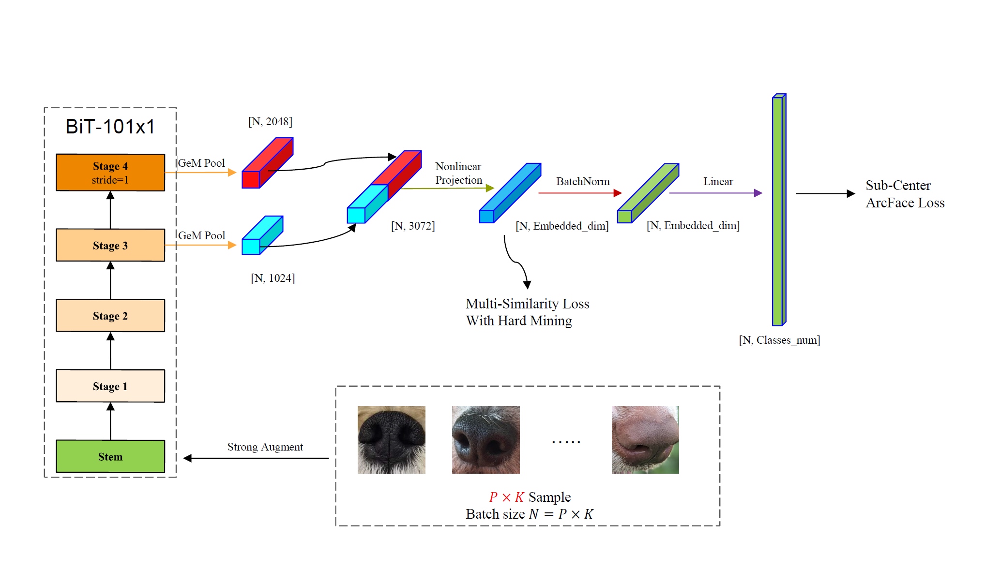

# CVPR2022 Biometrics Workshop Pet Biometric Challenge

队伍名：西电小Faker  线上成绩：0.863 排名：5


[tech report]: tech_report.pdf


## 运行环境
GPU: 8 * NVIDIA Geforce RTX 3090 24G  
CUDA: V11.2.142  
Pytorch: 1.11.0  
Python: 3.7.11  


## 关键依赖
1. pytorch
2. timm
3. pytorch-metric-learning
4. tensorboard
5. PyYAML
6. prettytable
7. opencv-python
8. albumentations
9. matplotlib


## 安装依赖
```
# 1. install timm (install the bleeding edge from GitHub)
pip install git+https://github.com/rwightman/pytorch-image-models.git

# 2. install requirements
pip install -r requirements.txt
```

## 方案描述

- 主干网络使用BiT-101x1, 其中最后一个stage没有使用下采样保证了特征图的分辨率，将stage3和stage4的特征图GeM Pooling后cat到一起，经过非线性映射到embedding维度得到embedding。Loss上使用了Multi-Similarity Loss和Sub-Center ArcFace Loss, 两个Loss使用BatchNorm1d隔开。
- Train data pipline：将图片保持长宽比resize到训练尺寸224x224，PxK采样，batchsize N = PxK，P表示在一个batch里随机采样P个ID，K表示每个ID采样K次，如果某个ID图片不足K张则重复采样。对每一张图片使用strong augment, 包括三类增强，1.色彩、对比度等抖动；2.旋转、翻转、裁切等变换；3.噪声、模糊、压缩等处理。
- Pseudo label on val dataset：将在验证集上的测试结果排序，取前N对匹配pair去重后加入训练集。
- Inference：将图片保持长宽比resize到推理尺寸224x224，使用非线性映射后的embedding作为模型的输出，计算每对piar的cosine similarity作为预测结果。
- Ensemble: 使用不同主干，不同对比Loss和分类Loss得到的模型输出的预测结果分布可能有差异，直接对预测结果进行平均会受到不同分布之间的影响，我们将各个模型的结果基于排序索引进行平均能够避免分布差异上带来的影响。


## 训练流程
### 配置文件命名介绍：
final_resnetv2_101x1_in1k_mstage_ArcFace_b150_k6_224_pseudo_val700_adamW_cosine_stride1_wcut_200e  
final：final开头命名表示复赛新加配置，其余为初赛时使用的配置  
resnetv2_101x1_in1k： 表示主干网络BiT-101x1 ImageNet1K上预训练模型  
mstage：使用stage3和stage4特征图  
ArcFace：使用ArcFace Loss  
b150: batchsize=150 
k6: 每个ID采样6张图片，150 = 6 * 25 
pseudo_val700: 使用验证集前700对匹配样本作为伪标签  
adamW_cosine: 使用adamW优化器余弦衰减策略  
stride1: stage3（图中的stage4） stride = 1  
wcut: 复赛时对图片在W方向random裁切  
200e: 训练200轮 


### 1.训练
```
# 默认权重、log保存到runs文件夹下
python train_all_in_one.py {config_file_path}
```
### 2.推理
```
# 修改test_predict.py 文件的模型和config路径
python test_predict.py
```
### 3.模型集成 
```
# 将ensemble_by_sort.py line86路径修改为所有结果的路径，默认为test_results
# 默认输出文件名为final_submmit_{len(file_path_list)}res.csv
python ensemble_by_sort.py
```


